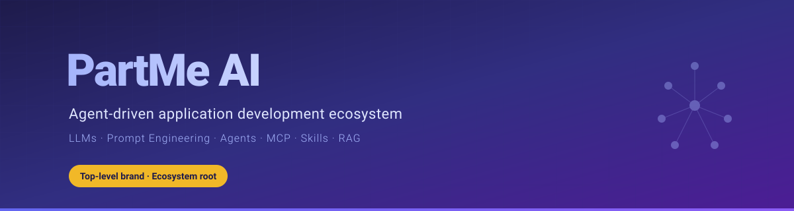

<p align="center">
  
</p>

# PartMe AI

[](https://github.com/partme-ai/full-stack-skills)
[](https://github.com/partme-ai/.github/blob/main/LICENSE)

**学习AI、掌握AI、聚焦智能体驱动（Agent-driven）的应用开发与落地，传播与AI有关的技术实践。**

> LLMs · 提示工程 · 函数调用 · RAG & Embeddings · Agents · MCP 协议 · Agent Skills · Agent Plugins · AIGC · Agent Loop · 多智能体协作 · 模型微调

---

## 关于我们

PartMe AI 是一个专注于 AI 智能体生态的技术组织，致力于：

- **全栈研发技能** — 覆盖前端、后端、移动端、架构设计、测试与运维
- **AIGC 创作技能** — 支持图像、视频、音频与 3D 内容制作
- **智能体插件与基础设施** — 连接设计、代码质量、内容生成和运维工具，提供 OpenClaw 插件、Spring AI 集成与 LLM 网关
- **工程实践沉淀** — 从需求到交付，以及从创意到内容发布的 Agent-driven 工作流

---

## 核心项目

### 技能与插件生态

<!-- ecosystem-navigation:start -->

| 方向 | 适用任务 | 目录与安装 | 组织 |
| --- | --- | --- | --- |
| Full Stack Skills | 软件开发、架构设计、测试与运维 | [PartMe.AI / full-stack-skills](https://github.com/partme-ai/full-stack-skills) | [full-stack-skills](https://github.com/full-stack-skills) |
| Full AIGC Skills | 图像、视频、音频等内容创作 | [PartMe.AI / full-aigc-skills](https://github.com/partme-ai/full-aigc-skills) | [full-aigc-skills](https://github.com/full-aigc-skills) |
| Full Stack Plugins | 研发与运维的工具集成和工作流 | [PartMe.AI / full-stack-plugins](https://github.com/partme-ai/full-stack-plugins) | [full-stack-plugins](https://github.com/full-stack-plugins) |
| Full AIGC Plugins | 内容制作的工具集成和生成工作流 | [PartMe.AI / full-aigc-plugins](https://github.com/partme-ai/full-aigc-plugins) | [full-aigc-plugins](https://github.com/full-aigc-plugins) |

<!-- ecosystem-navigation:end -->

全栈技能目录当前收录 **51 个技能包、788 个技能条目**（2026-10-06），统计范围与来源见[目录说明](https://github.com/partme-ai/full-stack-skills#简介)。

### 智能体基础设施

| 项目 | Stars | 说明 |
|------|-------|------|
| [openclaw-plugins](https://github.com/partme-ai/openclaw-plugins) |  | OpenClaw 30+ 企业级插件 |
| [teams-of-agents](https://github.com/partme-ai/teams-of-agents) |  | 多智能体协作团队 |
| [hermes-agent](https://github.com/partme-ai/hermes-agent) | — | 可成长的 AI Agent |

### Spring AI 与 LLM 工具

| 项目 | Stars | 说明 |
|------|-------|------|
| [spring-ai-examples](https://github.com/partme-ai/spring-ai-examples) |  | Spring AI 实践示例 |
| [spring-ai-gateway](https://github.com/partme-ai/spring-ai-gateway) |  | LLM/SLM API 网关 |
| [langchain4j-examples](https://github.com/partme-ai/langchain4j-examples) |  | Langchain4j 实践示例 |

### AI 应用与工具

| 项目 | Stars | 说明 |
|------|-------|------|
| [agency-agents-zh](https://github.com/partme-ai/agency-agents-zh) | — | 211 个即插即用 AI 专家角色 |
| [opencli](https://github.com/partme-ai/opencli) | — | 通用 CLI Hub 与 AI 原生运行时 |
| [opencli-admin](https://github.com/partme-ai/opencli-admin) | — | 可视化内容采集/AI 打标系统 |

---

## 技术栈

```
┌─────────────────────────────────────────────────────────┐
│                    AI 智能体层                           │
│  Agent Skills · Agent Loop · 多智能体协作 · MCP 协议     │
├─────────────────────────────────────────────────────────┤
│                    模型与推理层                          │
│  LLMs · Spring AI · Langchain4j · RAG · Embeddings     │
├─────────────────────────────────────────────────────────┤
│                    工程化与交付                          │
│  DDD · 微服务 · Docker · K8s · CI/CD · 测试             │
├─────────────────────────────────────────────────────────┤
│                    前端与跨端                            │
│  Vue · React · Flutter · Tauri · uni-app · Electron     │
└─────────────────────────────────────────────────────────┘
```

---

## 快速开始

### 安装 Agent Skills

```bash
# 在当前项目为 Codex 安装 Vue 3 技能
npx skills add full-stack-skills/vue-skills --skill vue3 --agent codex

# 查看 AIGC 技能包中的可选技能
npx skills add full-aigc-skills/coze-skills --list

# 手动安装技能包到 Claude Code 项目目录
git clone https://github.com/full-stack-skills/<package-name>.git
mkdir -p .claude/skills
cp -r <package-name>/skills/* .claude/skills/
```

### 安装插件

- [Full Stack Plugins 安装指南](https://github.com/partme-ai/full-stack-plugins#安装)：研发、设计、代码质量与运维工具。
- [Full AIGC Plugins 安装指南](https://github.com/partme-ai/full-aigc-plugins#安装)：图像、视频、音频与内容制作工具。

### Spring AI 集成

```xml
<dependency>
    <groupId>org.springframework.ai</groupId>
    <artifactId>spring-ai-spring-boot-starter</artifactId>
</dependency>
```

---

## 贡献指南

欢迎贡献技能、插件、实践示例或文档改进！

1. **Fork** 目标仓库
2. 遵循目标仓库的贡献说明；技能按 [Agent Skills 规范](https://agentskills.io/) 编写 `SKILL.md`
3. 提交 PR

技能结构规范：

```
skills/<skill>/
  SKILL.md      # 技能主文档（必需）
  agents/       # Codex 展示配置，如 openai.yaml（可选）
  examples/     # 使用示例（可选）
  references/   # 参考资料（可选）
  scripts/      # 自动化脚本（可选）
```

---

## 联系我们

- Email: [partmeai@gmail.com](mailto:partmeai@gmail.com)
- GitHub: [github.com/partme-ai](https://github.com/partme-ai)

---

<div align="center">

**学习AI · 掌握AI · 聚焦智能体驱动的应用开发与落地**

Made with ❤️ by PartMe AI Team

</div>
